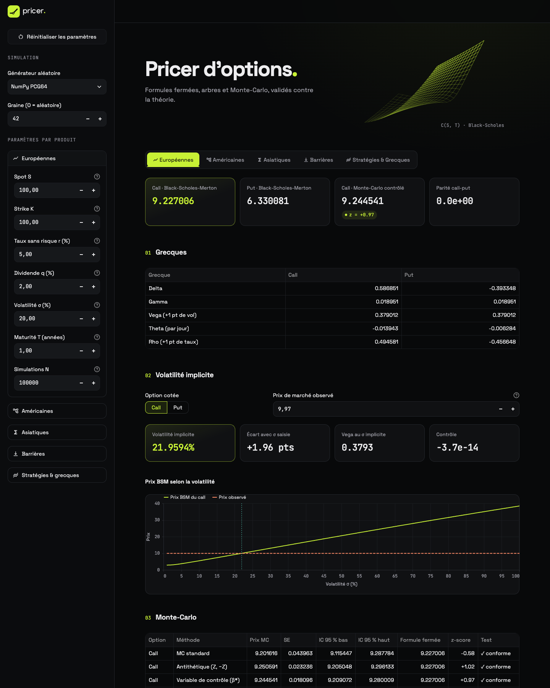
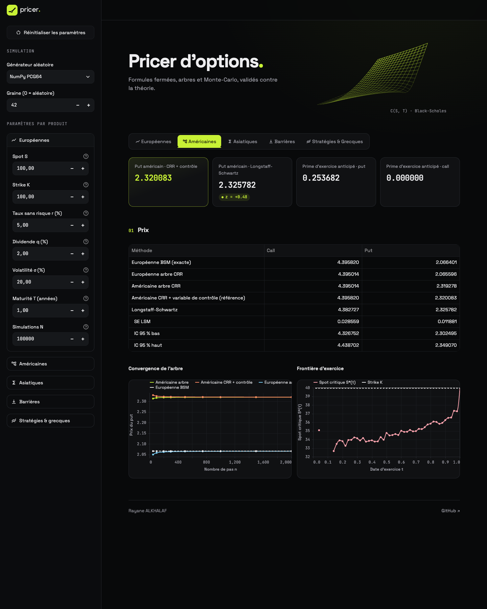
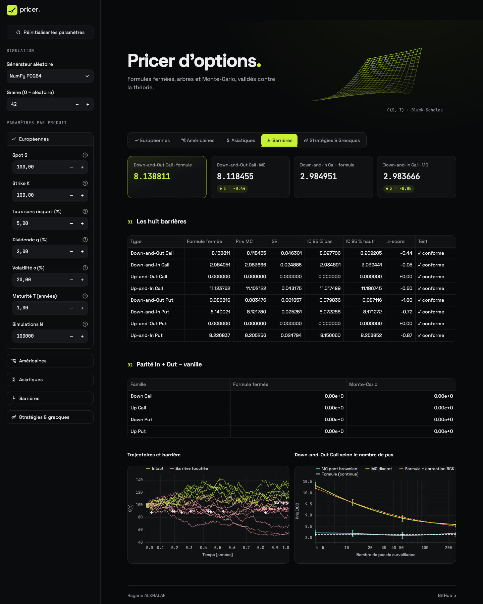

# Pricer d'options en Python

[](https://pricer-options.streamlit.app)
[](https://github.com/rayanealkhalaf/pricer-options/actions/workflows/tests.yml)


**▶ Démo en ligne : [pricer-options.streamlit.app](https://pricer-options.streamlit.app)**

Ce projet valorise des options européennes, américaines, asiatiques et barrières avec des
formules fermées, un arbre binomial et des simulations de Monte-Carlo. Chaque méthode
numérique est comparée à une formule exacte ou à une valeur de référence publiée.

C'est la reconstruction en Python de mon pricer Excel/VBA (le classeur n'est pas inclus
dans ce dépôt), dont les méthodes, les paramètres par défaut et les contrôles de validation sont repris
fidèlement (voir [docs/ANALYSE_EXCEL.md](docs/ANALYSE_EXCEL.md)).

*English version below.*

---

## Points clés

- **Exactitude** : les formules fermées reproduisent l'Excel à 1e-6 près. Sur le cas test de
  Longstaff-Schwartz (2001), S=36, K=40, le put américain vaut 4,4865 en CRR + contrôle et
  4,48 en LSM (4,472 dans l'article).
- **Validation statistique** : chaque Monte-Carlo affiche son z-score face à la formule
  exacte ou au prix de référence.
- **Réduction de variance** : pour l'asiatique, la variable de contrôle géométrique divise la
  variance par environ 1 300.
- **Qualité** : plus de 190 tests (pytest) et ruff, lancés par la CI sur Python 3.11 et 3.12.
  Code typé, formules dans les docstrings.

## Méthodes

| Produit | Formule fermée | Méthodes numériques |
|---|---|---|
| **Européennes** | Black-Scholes-Merton avec dividende continu q, les 5 grecques, parité call-put, volatilité implicite (méthode de Brent) | Monte-Carlo standard, antithétique, variable de contrôle `e^{-rT}S_T` (β* estimé) |
| **Américaines** | — (BSM sert de variable de contrôle) | Arbre de Cox-Ross-Rubinstein, correction `Am_arbre + BSM − Eu_arbre`, Longstaff-Schwartz (régression cubique) |
| **Asiatiques** (moyenne arithmétique discrète, strike fixe) | Asiatique géométrique exacte | Monte-Carlo standard, antithétique, contrôle par la géométrique |
| **Barrières** (8 types, sans rebate) | Reiner-Rubinstein (surveillance continue) | Monte-Carlo avec pont brownien, surveillance discrète, correction de Broadie-Glasserman-Kou |
| **Stratégies & grecques** | BSM par jambe, 16 stratégies + personnalisée | Points morts et gain/perte max exacts, scénario et P&L expliqué par les grecques, tableau comparatif |
| **Générateurs** | — | NumPy PCG64 (défaut), MRG32k3a + Box-Muller identique au VBA |

Chaque Monte-Carlo renvoie le prix, l'erreur standard, l'IC à 95 % et le z-score face à la
formule fermée. Les simulations sont entièrement vectorisées avec NumPy, sans boucle Python
sur les chemins. Les explications détaillées (intuition, formule, limites) sont dans
[docs/METHODES.md](docs/METHODES.md).

## Excel vs Python

| Produit | Paramètres | Grandeur | Excel | Python |
|---|---|---|---|---|
| Européenne | S=K=100, r=5 %, q=2 %, σ=20 %, T=1 | Call / Put BSM | 9,227006 / 6,330081 | 9,227006 / 6,330081 |
| | | Parité call-put | 0 | 0 (< 1e-10) |
| Américaine | S=K=40, r=6 %, q=0, σ=20 %, T=1 | Put CRR 1 000 pas + contrôle | 2,320083 | 2,320083 |
| | | Put Longstaff-Schwartz (20 000 chemins, 50 dates) | 2,3107 (SE 0,012) | 2,3258 (SE 0,012), à 0,5 SE de CRR+CV |
| | | Call américain − call européen (q = 0) | 0 | 0 |
| Asiatique | S=K=100, r=5 %, q=2 %, σ=20 %, T=1, 12 fixings | Géométrique exacte call / put | 5,327706 / 4,088834 | 5,327706 / 4,088834 |
| | | Arithmétique call, contrôle (N = 50 000) | 5,519595 (SE 0,00098) | 5,521452 (SE 0,00099) |
| Barrière | S=K=100, H=90, r=5 %, q=2 %, σ=25 %, T=1 | Down-and-Out / Down-and-In Call | 8,138811 / 2,984951 | 8,138811 / 2,984951 |
| | | Parités In + Out = vanille | 0 | 0 (< 1e-10) |
| Stratégies | S=100, r=5 %, q=0, σ=20 %, 100 jours, straddle K=100 | Coût net / Delta / Vega | 8,3628572 / 0,1453576 / 0,4106821 | identiques (< 1e-9) |
| | | Points morts | 91,6371 / 108,3629 | 91,6371 / 108,3629 |
| | | Scénario J+30 : P&L réel | −1,3685071 | −1,3685071 |

Les valeurs Monte-Carlo Python sont obtenues avec la graine 42 (PCG64). Un écart de l'ordre
de l'erreur standard avec l'Excel est donc normal, puisque les tirages diffèrent.

## Structure

```
pricer/
  validation.py   contrôles des entrées (repris du VBA), messages d'erreur en français
  rng.py          PCG64 et MRG32k3a + Box-Muller (vectorisé par saut en avant)
  bsm.py          Black-Scholes-Merton, parité call-put
  greeks.py       delta, gamma, vega (+1 pt), theta (par jour), rho (+1 pt)
  monte_carlo.py  estimateurs, Monte-Carlo européen, trajectoires, convergence
  trees.py        arbre CRR (européen et américain), correction par variable de contrôle
  lsm.py          Longstaff-Schwartz
  asian.py        asiatique géométrique exacte, Monte-Carlo arithmétique
  barrier.py      Reiner-Rubinstein, Monte-Carlo pont brownien et discret, BGK
  strategies.py   stratégies optionnelles, grecques de position, scénario, points morts
tests/            un fichier de tests par module (pytest)
notebooks/demo.ipynb   démonstration exécutée, avec graphiques de convergence
app.py            application Streamlit (onglets, calculs mis en cache)
interface/        présentation : composants, thème des graphiques (Altair)
assets/           logo et feuille de style
.streamlit/       thème de l'application
docs/             ANALYSE_EXCEL.md, METHODES.md
```

## Installation

Le projet nécessite Python 3.11 ou plus récent.

```bash
python3 -m venv .venv
```

```bash
source .venv/bin/activate
```

```bash
pip install -r requirements-dev.txt
```

`requirements.txt` ne contient que les dépendances de l'application (c'est lui que
Streamlit Community Cloud installe) ; `requirements-dev.txt` y ajoute pytest, ruff,
Jupyter et les outils de lecture du classeur.

## Commandes

Lancer les tests :

```bash
python -m pytest
```

Lancer l'interface :

```bash
streamlit run app.py
```

Ouvrir le notebook :

```bash
jupyter notebook notebooks/demo.ipynb
```

Vérifier le formatage et le lint :

```bash
ruff format --check . && ruff check .
```

Exemple d'utilisation de la bibliothèque :

```python
from pricer import (
    americaine_crr_controle,
    mc_europeenne,
    prix_barriere,
    prix_bsm,
    volatilite_implicite,
)

prix_bsm(100, 100, 0.05, 0.02, 0.20, 1.0, "call")  # 9.227006
volatilite_implicite(9.227006, 100, 100, 0.05, 0.02, 1.0, "call")  # 0.20
mc_europeenne(100, 100, 0.05, 0.02, 0.20, 1.0, n_sim=100_000, graine=42).z_scores()
americaine_crr_controle(40, 40, 0.06, 0.0, 0.20, 1.0, n_pas=1000).cv_put  # 2.320083
prix_barriere(100, 100, 90, 0.05, 0.02, 0.25, 1.0, "DOC")  # 8.138811
```

## Captures d'écran







## Limites

Le modèle suppose une volatilité et des taux constants (pas de smile, pas de dividendes
discrets). Les barrières sont sans rebate, et les asiatiques sont à strike fixe. Ce projet est
pédagogique et ne constitue pas un conseil en investissement.

## Auteur

Rayane ALKHALAF · [github.com/rayanealkhalaf](https://github.com/rayanealkhalaf)

## Licence

MIT, © 2026 Rayane ALKHALAF (voir [LICENSE](LICENSE)).

---

# English version

**▶ Live demo: [pricer-options.streamlit.app](https://pricer-options.streamlit.app)**

## Purpose

This project is an option pricer for European, American, Asian and barrier options, built
in Python from my original Excel/VBA tool. It uses closed-form formulas, a binomial tree and
Monte Carlo simulation. Every numerical engine is checked against an exact formula or a
published reference value, with statistical tests (z-scores). The test suite (190+ tests)
runs in CI on Python 3.11 and 3.12.

## Methods

- **European options**: Black-Scholes-Merton with a continuous dividend yield, the five
  Greeks (vega and rho per 1 percentage point, theta per calendar day) and a put-call parity
  check. Implied volatility is recovered from a market price with Brent's method (bracketed,
  so it always converges, unlike Newton-Raphson far from the money). Monte Carlo comes in
  three versions: plain, antithetic, and with a control variate
  (discounted `S_T`, with an estimated β*).
- **American options**: a Cox-Ross-Rubinstein tree (European and American prices from one
  backward induction), a control-variate correction (American tree + BSM − European tree),
  and Longstaff-Schwartz (cubic regression on in-the-money paths, discrete exercise dates,
  standard error computed on antithetic pairs).
- **Asian options** (discrete arithmetic average, fixed strike): plain Monte Carlo,
  antithetic Monte Carlo, and the exact geometric Asian price as a control variate. The
  control variate reduces variance more than 1,000 times.
- **Barrier options** (all 8 Down/Up, In/Out, Call/Put types): Reiner-Rubinstein closed forms
  (continuous monitoring, no rebate), and Monte Carlo with a Brownian-bridge correction
  (unbiased for any time step). Discrete monitoring is also available, with the
  Broadie-Glasserman-Kou continuity correction. In + Out = vanilla parity is checked.
- **Random numbers**: NumPy PCG64 by default, or MRG32k3a (L'Ecuyer, 1999) with Box-Muller,
  which reproduces the VBA sequence exactly (vectorised with jump-ahead).

The simulations are fully vectorised with NumPy, inputs are validated with clear error
messages, and the code is typed and documented with formulas in French docstrings.

## Excel vs Python

See the table in the French section. All closed-form values match the spreadsheet to 1e-6.
The Monte Carlo estimates fall within three standard errors of the closed-form prices.

## Getting started

```bash
python3 -m venv .venv && source .venv/bin/activate && pip install -r requirements-dev.txt
```

```bash
python -m pytest
```

```bash
streamlit run app.py
```

```bash
jupyter notebook notebooks/demo.ipynb
```

Screenshots of the European, American and barrier tabs are in the French section above
(`docs/img/`).

## Author

Rayane ALKHALAF · [github.com/rayanealkhalaf](https://github.com/rayanealkhalaf)

## License

MIT, © 2026 Rayane ALKHALAF.
